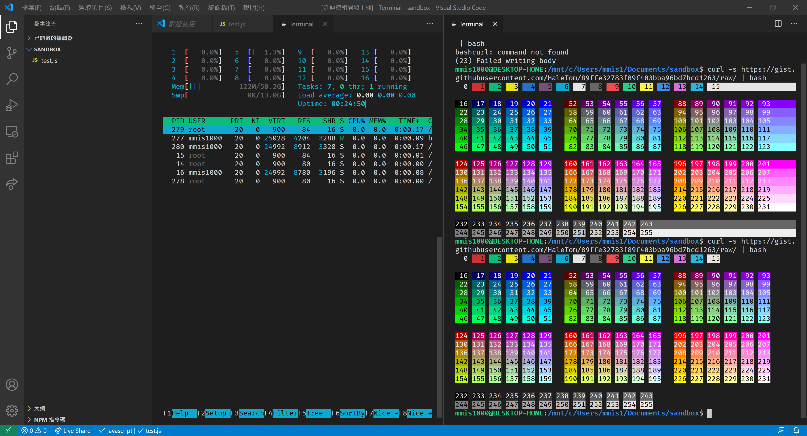

# Terminal Tab

<a href="https://opensource.org/licenses/MIT">
    
</a>
<a href="https://marketplace.visualstudio.com/items?itemName=mmis1000-personal.terminaltab">
    
</a>

## Warning
```txt
This repository abused non-public API in the vscode and will break at any time in the future.
Please use at your own caution.
See issue list below.
```

This extension is a experiment about terminal in editor tab experience.  



There may not be any future feature release because this repository is intended to be used as an POC.  
But fork, modify and republish it is welcome as long as you follow the MIT license.

## Features

Besides open the terminal as an editor tab.  
It is also experiment of

1. auto recover tab (its cwd and env) on load workspace
2. auto recover terminal content after recover the tag (just like iterm 2)
3. persistent session with tmux (idea stole form from cloud9 ide)

## Commands

1. Launch a terminal tab here
   1. Terminal session gone on vscode closed
   2. However terminal content was restore on vscode restart.
   3. Shortcuts
      1. Also available as shortcut on top right of editor column
      2. Also available as file menu shortcut
2. Launch a tmux baked terminal tab here
   1. Terminal session is not destroyed unless you close the tab (even close editor does not matter).
   2. Session can be listed with `tmux -L vscode-terminal-tab list-sessions`

## Requirements

1. Access to shell env. (or you can't open terminal)
2. Tmux installed if you want to use tmux baked terminal tab.

## Extension Settings

No.

All setting are read directly from integrated terminal setting.

## Known Issues

1. Integration with the vscode is lacking because there is no api for that.  
    The tab looks more like a terminal that live in vscode by accident.
2. There is no formal way to use native module in native extension, so I abused internals of vscode.
3. There is no formal way to use production icon in webview tab title, so I copied it directly from codicons.

## Release Notes

### 0.1.0

Feat: Support `terminal.integrated.env.*`
Fix: Fix locale detection

### 0.0.7

Feat: Add a tmux baked persistent terminal.

### 0.0.6

Fix: Apply default shell args from `terminal.integrated.shellArgs.${platform}`

### 0.0.5

Feat: Add icon to the tab title.

### 0.0.4

Fix: Save/restore current shell at tab creation that correspond to the terminal tab.  
Feat: Forward shell title.  
Feat: Add a short cut on editor title to open new terminal.

### 0.0.3

Update description only

### 0.0.2

Update description only

### 0.0.1

Initial publish

## See Also

### Terminal issues

- [Vscode: Tabs for integrated terminal](https://github.com/microsoft/vscode/issues/10546)  
- [Vscode: Retain terminal processes between window reloads](https://github.com/microsoft/vscode/issues/20013)

### Extension issues

- [Vscode: Allow Extensions to use native modules shipped with vscode](https://github.com/microsoft/vscode/issues/84439)
- [Vscode: Support Platform Specific Extensions](https://github.com/microsoft/vscode/issues/23251)
- [Vscode: Allow ThemeIcon in WebviewPanel.iconPath](https://github.com/microsoft/vscode/issues/90616)

## Note

The icons are from [codicons](https://github.com/microsoft/vscode-codicons).