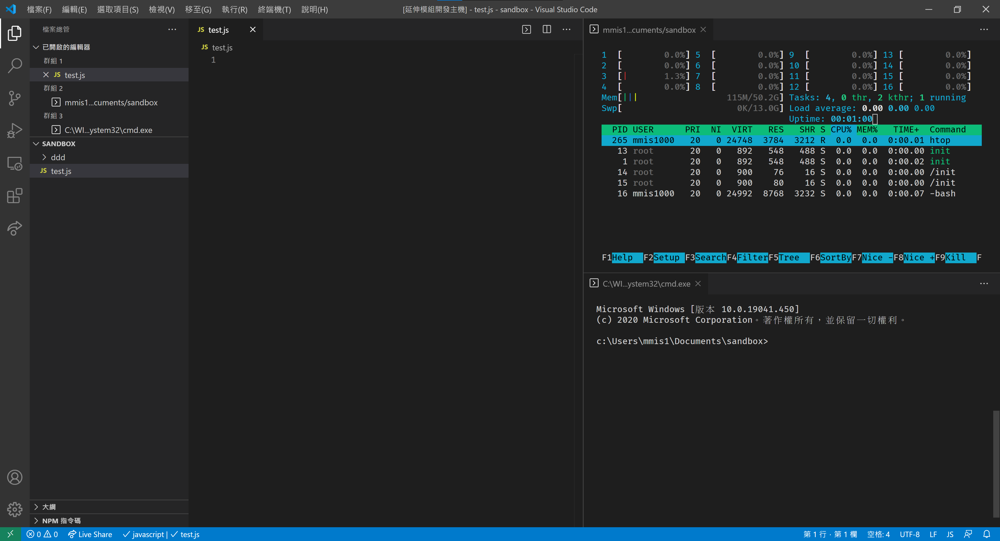

# Terminal Tab

<a href="https://opensource.org/licenses/MIT">
    
</a>
<a href="https://marketplace.visualstudio.com/items?itemName=mmis1000-personal.terminaltab">
    
</a>

## Warning
```txt
This repository abused non-public API in the vscode and will break at any time in the future.
Please use at your own caution.
See issue list below.
```

This extension is a experiment about terminal in editor tab experience.  



There may not be any future feature release because this repository is intended to be used as an POC.  
But fork, modify and republish it is welcome as long as you follow the MIT license.

## Features

Besides open the terminal as an editor tab.  
It is also experiment of

1. auto recover tab (its cwd and env) on load workspace
2. auto recover terminal content after recover the tag (just like iterm 2)

## Requirements

You need to have access to shell env. (or you can't open terminal)

## Extension Settings

No

## Known Issues

Integration with the vscode is lacking because there is no api for that.  
The tab looks more like a terminal that live in vscode by accident.

There is no formal way to use native module in native extension, so I abused internals of vscode.

## Release Notes

### 0.0.2

Update description only

### 0.0.1

Initial publish

## See Also

### Terminal issues

- [Vscode: Tabs for integrated terminal](https://github.com/microsoft/vscode/issues/10546)  
- [Vscode: Retain terminal processes between window reloads](https://github.com/microsoft/vscode/issues/20013)

### Extension issues

- [Vscode: Allow Extensions to use native modules shipped with vscode](https://github.com/microsoft/vscode/issues/84439)
- [Vscode: Support Platform Specific Extensions](https://github.com/microsoft/vscode/issues/23251)